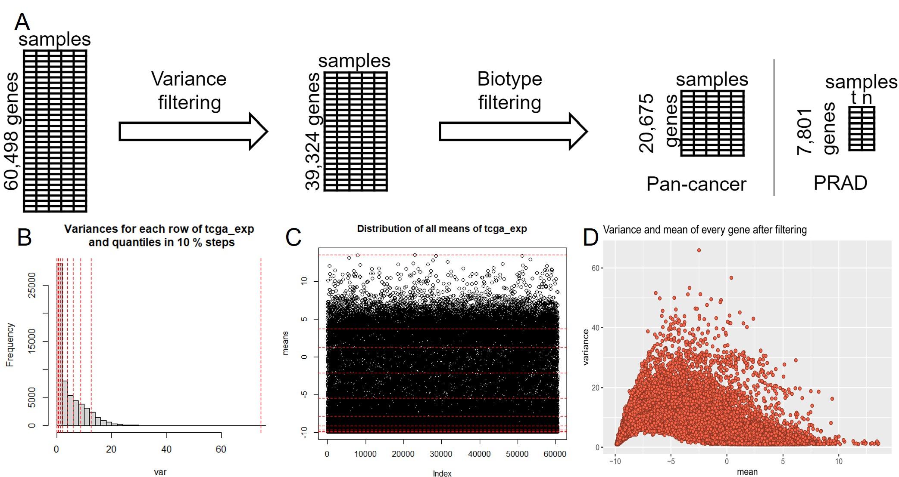

\pagenumbering{arabic}
\begin{titlepage}
\centering
	{\Large Ruprecht-Karls-Universität Heidelberg\\
		Fakultät für Biowissenschaften\\
		Bachelorstudiengang Molekulare Biotechnologie\\}

	{\vspace{\stretch{3}}}

		{\Huge Cancer Hallmark and Metabolic Pathways differ over Cancer types and in Prostate Adenocarcinoma patients}

		

	

	\vspace{\stretch{4}}
	{\Large Data Science Project SoSe 2022}

	\vspace{\stretch{0.25}}
	
{\Large
	 `r format(Sys.time(),'%d %B %Y')`
}
	\vspace{\stretch{0.75}}

	{\Large
		Fabian Strobel, Lottida Phondeth, Laura Lange, Carla Welz  
}

	\vspace{\stretch{1}}

\end{titlepage}

\newpage
\tableofcontents

\newpage
# Introduction
## vfbdjns
## jutzhgrfedw

Type 'demo()' for some demos, 'help()' for on-line help, or
'help.start()' for an HTML browser interface to help.
Type 'q()' to quit R. [@10.3389/fmolb.2020.00053,]

***
# Methods
## Initial raw data
During our project, we used four given data sets. The first was an R-object consisting of a list of gene sets for cancer hallmarks. Second, a pan-cancer RNA-seq gene expression data frame for 9,741 patients of 33 various cancer types based on data generated by the “The Cancer Genome Atlas” Research Network: https://www.cancer.gov/tcga. In addition, there was an R-object containing 37 clinical annotations regarding the RNA-seq patients. And fourth, for a focused analysis of PRAD, an R-object with RNA-seq gene expression data of matched tumor tissue and normal tissue of 52 PRAD patients was used. 

## Preprocessing
The RNA-seq data came in a log2(TPM) format which served as normalization technique. The original pan-cancer data frame, which contained 60,498 genes, was preprocessed as follows (Figure 1A): After confirming the absence of missing values, the means and variances for all genes were calculated (Figure 1B, C). To remove rather constant genes across all cancer types, variance filtering was performed, were all genes with a variance below the 35 % quantile were discarded (Figure 1D). 

\newpage

***
# Results
## uztrewertzu
## kujzhtgrfe

***
# Discussion
## kjhtgrfedws
## uztrwwret  

***
# Refrences
  