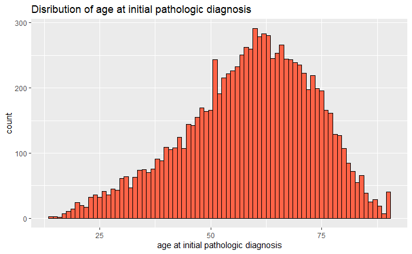
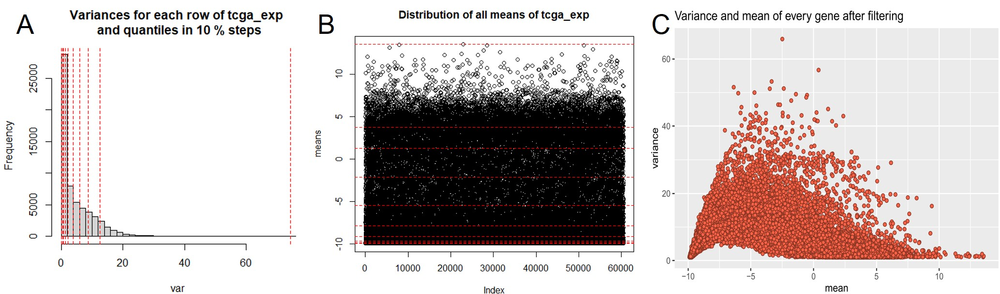
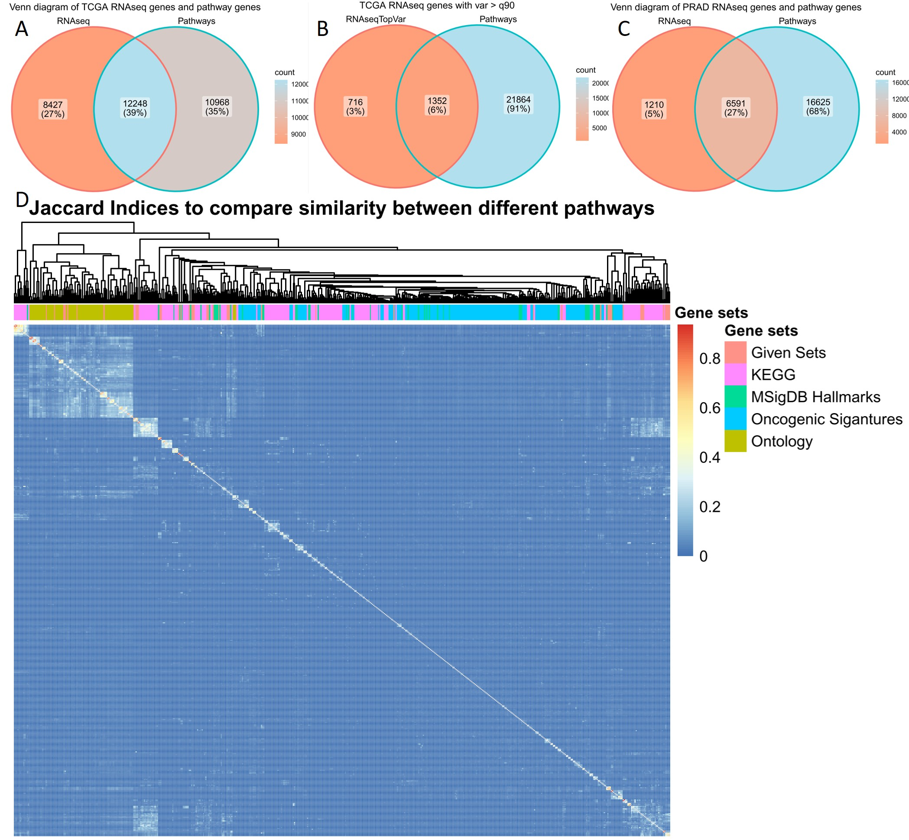
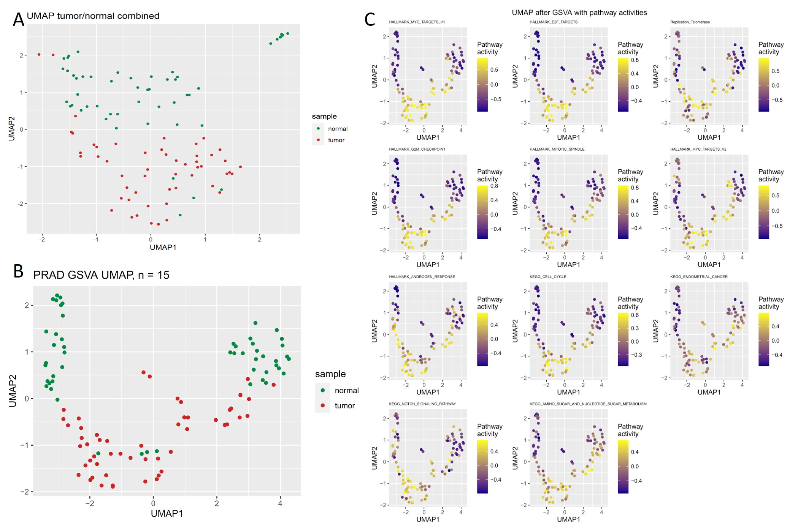

\pagenumbering{arabic}
\begin{titlepage}
\centering
	{\Large Ruprecht-Karls-Universität Heidelberg\\
		Fakultät für Biowissenschaften\\
		Bachelorstudiengang Molekulare Biotechnologie\\}

	{\vspace{\stretch{3}}}

		{\Huge Cancer Hallmark and Metabolic Pathways differ over Cancer types and in Prostate Adenocarcinoma patients}

		

	

	\vspace{\stretch{4}}
	{\Large Data Science Project SoSe 2022}

	\vspace{\stretch{0.25}}
	
{\Large
	 `r format(Sys.time(),'%d %B %Y')`
}
	\vspace{\stretch{0.75}}

	{\Large
		Fabian Strobel, Lottida Phondeth, Laura Lange, Carla Welz  
}

	\vspace{\stretch{1}}

\end{titlepage}

\newpage
\tableofcontents

\newpage
# Introduction
## Hallmarks of cancer
Immortality has long been associated with cancer cells and has been a key component of research, tracing back to the discovery and distribution of HeLa cells (Skloot et al., 2010). It was in the year 2000 that the researchers Hanahan and Weinberg defined the characteristics of cancer cells in their publication “The hallmarks of cancer”, therefore shaping our understanding of cancer (Hanahan and Weinberg, 2000). They described qualities such as immortalization, immune evasion, or angiogenesis need to apply to cells to be considered a cancer cell. Additional characteristics were published in their 2011 postulation “Hallmarks of cancer: the next generation” (Hanahan and Weinberg, 2011). One major hallmark that offers a myriad of pharmacological interventions is the “deregulation of cellular energetics”. Altering metabolic pathways, therefore providing an energy supply, thus supporting cell proliferation, can be seen in various cancer types such as prostate adenocarcinoma.

## Prostate adenocarcinoma
According to the GLOBOCAN 2020 estimates stemming from the International Agency for Research on cancer, prostate cancer is the second most common cancer found in men worldwide - making up about 1.4 million cases of the 10.1 million new cases of all combined cancers diagnosed in males. 
While the prevalence of prostate cancer is clear, the cause of it is not. However, it has been noticed that prostate cancer can be found more commonly in older males and therefore age could pose a potential risk factor (Bechis et al., 2011). 
The most recurrent diagnosed prostate cancer type is the so-called prostate adenocarcinoma (PRAD) (Li et al., 2016). The most common and effective ways to treat prostate cancers, in general, are surgery and radiation therapy. These treatments only apply to a non-metastatic disease progression. Metastatic prostate cancer calls for androgen deprivation therapy (Litwin and Tan, 2017). The absence of these androgen hormones leads to a significant decrease in the progression of prostate adenocarcinoma. However, once these cancer cells find a way to regain the activity of components that are part of the androgen receptor triggered signaling pathway, regardless of the androgen hormone absence, it is even harder to treat it. Therefore, it is ever so more important to understand the metabolic changes in prostate adenocarcinomas (Ahmad et al., 2021). 

## Transcriptomic profiling
The data analysis project revolves around RNA-seq data derived from the cancer genome atlas. It gives an overview of the transcriptome, meaning the RNAs present in a sample such as a tissue. Additionally, the RNA-seq data quantifies the transcripts of a specific gene and therefore describes a good way to determine the relevance of certain genes in specific samples, especially since the amount of reads of a gene determines the generation of certain proteins.

## The best way to analyze RNA-seq data
Usually, RNA-seq data comprises copious amounts of genes, which is why analyzing single genes has been a common practice. One major challenge that could result from solely focusing on a few genes is to understand the impact certain expressional changes of a specific gene can have on a pathway that is made up of a cascade of genes. To avoid this altogether analyzing RNA-seq data as gene sets and not as single genes is more practical. Methods that are based on analyzing gene sets such as the Gene Set Enrichment Analysis (GSEA) or the Gene Set Variation Analysis GSVA are therefore favorable (Hänzelmann et al., 2013; Subramanian et al., 2005).

## General questions and the path to their answers
By analyzing the given RNA-seq data the goal was to identify patterns between cancer types of the data set, as well as potentially find significant differences in pathways between normal and cancer cells. Additionally, quantifying and clustering pathway activity was to be achieved. Using common methods such as a principal component analysis and heatmaps are the building blocks of cluster finding. Newer methods that were applied pose the Uniform Manifold Approximation and Projection (UMAP) as a means for dimensional reduction and formation of clusters and the GSVA as a means for characterizing and quantifying the pathway performance in specific samples (McInnes and Healy, 2018). Visualizing and selecting differentially expressed genes between two different phenotypes such as cancer or normal cells can be done with volcano plots.

Type 'demo()' for some demos, 'help()' for on-line help, or
'help.start()' for an HTML browser interface to help.
Type 'q()' to quit R. [@RN1]

***
# Methods
## Initial raw data
During our project, we used four given data sets. The first was an R-object consisting of a list of gene sets for cancer hallmarks. Second, a pan-cancer RNA-seq gene expression data frame for 9,741 patients of 33 various cancer types based on data generated by the “The Cancer Genome Atlas” Research Network: https://www.cancer.gov/tcga. In addition, there was an R-object containing 37 clinical annotations regarding the RNA-seq patients. And fourth, for a focused analysis of PRAD, an R-object with RNA-seq gene expression data of matched tumor tissue and normal tissue of 52 PRAD patients was used.
To get a broader view of the cancer hallmarks and metabolic activities, additional gene sets were chosen from the Molecular Signatures Database (MSigDB) (Liberzon et al., 2011; Subramanian et al., 2005) after literature review. Trying to get a large overlap with the genes from the RNA-seq, 509 additional gene sets were used, resulting in a total number of 555 gene sets used during the study. These include 50 hallmark gene sets (Liberzon et al., 2015), 186 curated gene sets from the KEGG pathway database (Kanehisa, 2019; Kanehisa et al., 2021; Kanehisa and Goto, 2000), 189 oncogenic signature gene sets (Liberzon et al., 2011; Subramanian et al., 2005) and the 84 largest ontology gene sets (Ashburner et al., 2000; GOC, 2021; Köhler et al., 2020) as of June 2022.

## Preprocessing
The RNA-seq data came in a log2(TPM) format which served as normalization technique. 

## Analysis of gene sets
To get a sense of the meaningfulness of the used gene sets in the study, their overlap with the genes of the RNAseq was investigated using Venn diagrams. 

Before analyzing the RNA-seq data, a comparison of the gene sets was performed. Therefore, it was necessary to convert all gene names into the same format. The gene symbols in the pathways of the given gene sets were converted into Ensemble gene IDs using the *EnsDb.Hsapiens.v79 package*. Regarding the additional gene sets, the genes were also imported as Ensembl gene IDs. Next, all gene sets were combined into one list. To take a closer look at the gene sets, the similarity between them was investigated. As a metric which compares how many genes are shared between the different gene sets, the Jaccard Indices
$$
J(A, B) = \frac{|A \cap B|}{|A \cup B|} \> with \\ 0 \leq J(A, B) \leq 1
$$
were computed for each combination. These result in a value between zero and one, which is the ratio between the intersection and union of the two respective pathways (Levandowsky and Winter, 1971). After computing the Jaccard indices for every combination, a heatmap was created, which also clustered the gene sets.

## Pan-cancer analysis

### descriptive analsis --> CARLA

### linear regression

## Focused analysis: Prostate adenocarcinome
### descriptive analysis CARLA
As with the pan-cancer RNAseq data frame, PCA and UMAP were applied on a combined data frame of tumor and normal samples from RNAseq.
### Volcano Plots LAURA

### Gene ontology enrichment analysis

### GSEA/GSVA

### PRAD pathway activity matrix --> HEATMAP

After GSVA PCA and UMAP were applied on the pathway activity matrix. Furthermore, the pathway activity of the differentially expressed genes was visualized in the figure. 

***
# Results

## Preprocessing

## Gene set analysis

## Pan-cancer analysis

***
# Discussion
## kjhtgrfedws
## uztrwwret  

***
# Refrences
 
## used packages

{width=70%}