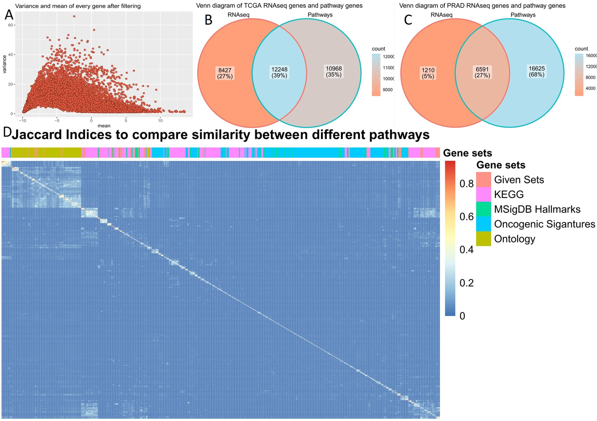

\pagenumbering{arabic}
\begin{titlepage}
\centering
	{\Large Ruprecht-Karls-Universität Heidelberg\\
		Fakultät für Biowissenschaften\\
		Bachelorstudiengang Molekulare Biotechnologie\\}

	{\vspace{\stretch{3}}}

		{\Huge Cancer Hallmark and Metabolic Pathways differ over Cancer types and in Prostate Adenocarcinoma patients}

		

	

	\vspace{\stretch{4}}
	{\Large Data Science Project SoSe 2022}

	\vspace{\stretch{0.25}}
	
{\Large
	 `r format(Sys.time(),'%d %B %Y')`
}
	\vspace{\stretch{0.75}}

	{\Large
		Fabian Strobel, Lottida Phondeth, Laura Lange, Carla Welz  
}

	\vspace{\stretch{1}}

\end{titlepage}

\newpage
\tableofcontents

\newpage
# Introduction
## Hallmarks of cancer
Immortality has long been associated with cancer cells and has been a key component of research, tracing back to the discovery and distribution of HeLa cells (Skloot et al., 2010). It was in the year 2000 that the researchers Hanahan and Weinberg defined the characteristics of cancer cells in their publication “The hallmarks of cancer”, therefore shaping our understanding of cancer (Hanahan and Weinberg, 2000). They described qualities such as immortalization, immune evasion, or angiogenesis need to apply to cells to be considered a cancer cell. Additional characteristics were published in their 2011 postulation “Hallmarks of cancer: the next generation” (Hanahan and Weinberg, 2011). One major hallmark that offers a myriad of pharmacological interventions is the “deregulation of cellular energetics”. Altering metabolic pathways, therefore providing an energy supply, thus supporting cell proliferation, can be seen in various cancer types such as prostate adenocarcinoma.

## Prostate adenocarcinoma
According to the GLOBOCAN 2020 estimates stemming from the International Agency for Research on cancer, prostate cancer is the second most common cancer found in men worldwide - making up about 1.4 million cases of the 10.1 million new cases of all combined cancers diagnosed in males. 
While the prevalence of prostate cancer is clear, the cause of it is not. However, it has been noticed that prostate cancer can be found more commonly in older males and therefore age could pose a potential risk factor (Bechis et al., 2011). 
The most recurrent diagnosed prostate cancer type is the so-called prostate adenocarcinoma (PRAD) (Li et al., 2016). The most common and effective ways to treat prostate cancers, in general, are surgery and radiation therapy. These treatments only apply to a non-metastatic disease progression. Metastatic prostate cancer calls for androgen deprivation therapy (Litwin and Tan, 2017). The absence of these androgen hormones leads to a significant decrease in the progression of prostate adenocarcinoma. However, once these cancer cells find a way to regain the activity of components that are part of the androgen receptor triggered signaling pathway, regardless of the androgen hormone absence, it is even harder to treat it. Therefore, it is ever so more important to understand the metabolic changes in prostate adenocarcinomas (Ahmad et al., 2021). 

## Transcriptomic profiling
The data analysis project revolves around RNA-seq data derived from the cancer genome atlas. It gives an overview of the transcriptome, meaning the RNAs present in a sample such as a tissue. Additionally, the RNA-seq data quantifies the transcripts of a specific gene and therefore describes a good way to determine the relevance of certain genes in specific samples, especially since the amount of reads of a gene determines the generation of certain proteins.

## The best way to analyze RNA-seq data
Usually, RNA-seq data comprises copious amounts of genes, which is why analyzing single genes has been a common practice. One major challenge that could result from solely focusing on a few genes is to understand the impact certain expressional changes of a specific gene can have on a pathway that is made up of a cascade of genes. To avoid this altogether analyzing RNA-seq data as gene sets and not as single genes is more practical. Methods that are based on analyzing gene sets such as the Gene Set Enrichment Analysis (GSEA) or the Gene Set Variation Analysis GSVA are therefore favorable (Hänzelmann et al., 2013; Subramanian et al., 2005).

## General questions and the path to their answers
By analyzing the given RNA-seq data the goal was to identify patterns between cancer types of the data set, as well as potentially find significant differences in pathways between normal and cancer cells. Additionally, quantifying and clustering pathway activity was to be achieved. Using common methods such as a principal component analysis and heatmaps are the building blocks of cluster finding. Newer methods that were applied pose the Uniform Manifold Approximation and Projection (UMAP) as a means for dimensional reduction and formation of clusters and the GSVA as a means for characterizing and quantifying the pathway performance in specific samples (McInnes and Healy, 2018). Visualizing and selecting differentially expressed genes between two different phenotypes such as cancer or normal cells can be done with volcano plots.

***

# Methods
## Initial raw data
During our project, we used four given data sets. The first was an R-object consisting of a list of gene sets for cancer hallmarks. Second, a pan-cancer RNA-seq gene expression data frame for 9,741 patients of 33 various cancer types based on data generated by the “The Cancer Genome Atlas” Research Network: https://www.cancer.gov/tcga. In addition, there was an R-object containing 37 clinical annotations regarding the RNA-seq patients. And fourth, for a focused analysis of PRAD, an R-object with RNA-seq gene expression data of matched tumor tissue and normal tissue of 52 PRAD patients was used.
To get a broader view of the cancer hallmarks and metabolic activities, additional gene sets were chosen from the Molecular Signatures Database (MSigDB) (Liberzon et al., 2011; Subramanian et al., 2005) after literature review. Trying to get a large overlap with the genes from the RNA-seq, 509 additional gene sets were used, resulting in a total number of 555 gene sets used during the study. These include 50 hallmark gene sets (Liberzon et al., 2015), 186 curated gene sets from the KEGG pathway database (Kanehisa, 2019; Kanehisa et al., 2021; Kanehisa and Goto, 2000), 189 oncogenic signature gene sets (Liberzon et al., 2011; Subramanian et al., 2005) and the 84 largest ontology gene sets (Ashburner et al., 2000; GOC, 2021; Köhler et al., 2020) as of June 2022.

## Preprocessing
The RNA-seq data came in a log2(TPM) format which served as normalization technique. The original pan-cancer data frame, which contained 60,498 genes, was preprocessed as follows (Figure 1): After confirming the absence of missing values, the means and variances for all genes were calculated. To remove rather constant genes across all cancer types, variance filtering was performed, were all genes with a variance below the 35 % quantile were discarded. Following this, the biotypes of the remaining 39,324 genes were identified by using the EnsDb.Hsapiens.v79 package (Citation). 98 genes which could not be attributed with a biotype were also removed. For the rest, the frequency of each occurring biotype was counted. For further analysis, the most interesting biotypes within the RNA-seq data frame were kept. These include short non-coding RNAs like small nuclear RNAs, micro RNAs, ribosomal RNAs and small nucleolar RNAs, which are known to have important functions in molecular biology (Alberts, 2015). Furthermore, long non-coding RNAs, which are longer than 200 bp in length and might possess regulatory functions (Alberts, 2015; Cunningham et al., 2021) and protein coding genes were retained. The latter also included T cell receptor genes and immunoglobulin genes that both undergo somatic recombination and were listed with separate biotypes (Cunningham et al., 2021). All chosen biotypes also appeared within the pathways. After removing the other biotypes from the pan-cancer data frame, it only contained 20,675 genes. Similarly, the combined PRAD data frame was variance filtered using a 60 % quantile threshold. In contrast to the pan-cancer analysis biotypes, only protein coding genes and long non-coding genes were present and therefore kept resulting in a final data frame with 7,801 genes.

## Analysis of gene sets
To get a sense of the meaningfulness of the used gene sets in the study, their overlap with the genes of the RNAseq was investigated using Venn diagrams. Before analyzing the RNA-seq data, a comparison of the gene sets was performed. Therefore, it was necessary to convert all gene names into the same format. The gene symbols in the pathways of the given gene sets were converted into Ensemble gene IDs using the *EnsDb.Hsapiens.v79 package*. Regarding the additional gene sets, the genes were also imported as Ensembl gene IDs. Next, all gene sets were combined into one list. To take a closer look at the gene sets, the similarity between them was investigated. As a metric which compares how many genes are shared between the different gene sets, the Jaccard Indices
$$
J(A, B) = \frac{|A \cap B|}{|A \cup B|} \> with \\ 0 \leq J(A, B) \leq 1
$$
were computed for each combination. These result in a value between zero and one, which is the ratio between the intersection and union of the two respective pathways (Levandowsky and Winter, 1971). After computing the Jaccard indices for every combination, a heatmap was created, which also clustered the gene sets.

## Pan-cancer analysis

To start off, different descriptive plots were produced based on the given data. For example, the data was checked for normality. Next, a histogram for age at initial cancer diagnosis or the frequency of cancer types throughout the pan-cancer analysis. For further dimension reduction a Principal Component Analysis (PCA) (Jolliffe, 2011) was applied over the full pan-cancer data using the Seurat package. With the resulting first 50 principal components, Uniform Manifold Approximation and Projection (UMAP) (McInnes and Healy, 2018) with a set seed (123) was performed with the uwot package. By using “cosine” (why) as metric two UMAP components were calculated and later plotted in a two-dimensional plot. The same analysis was used after dividing the whole data into the 33 different cancer types with 35 principal components. 
Next, Gene Set Variation Analysis (GSVA) was carried out. GSVA allows summarizing single genes into defined pathways or gene sets. This reduces the dimensionality of the RNAseq data and eases biological interpretability. The input for the GSVA algorithm is a data frame of log2 RNA-seq counts and a list of gene sets. To calculate a ranking-score a cumulative density function is estimated for each gene over all samples.  The ranking-score is the probability for the specific gene expression in the corresponding sample. These scores are then used to create a ranked list of genes for each sample. The ranked list is the basis to access the GSVA enrichment score. In total 2 random walks are done. The first one regards the genes in the gene set. The algorithm iterates over each gene in the ranked list and checks if it is in the gene set. The ranks of the genes present in the gene set are added to a running sum. For the genes that are not present the running sum is kept as it is. In the second random walk the value 1 is added to the running sum if the genes that are not present in the gene set. If the gene is in the gene set, the running sum remains unchanged. The enrichment score is the difference between the largest positive and the largest negative deviations. (Hänzelmann et al., 2013). For this study, this method resulted in a pathway activity matrix with the samples as columns and 552 pathways as rows. Three pathways were discarded by the GSVA package because of a too small intersection between pathway genes and RNAseq genes, since the minimum size of the resulting gene sets was set to 3. Otherwise, the functions default settings were used. Trying to determine the win or loss of information caused by the GSVA a PCA followed by UMAP was done for the pathway activity matrix with the same settings as mentioned before. To explain the resulting clusters, the pathway activity for the pathways with the highest variance was visualized in a heatmap. Another heatmap was created in which the mean pathways activity for each cancer type was determined and plotted against the pathways.
Finally, a linear regression model was built to predict…

## Focused analysis: Prostate adenocarcinoma 

For the focused analysis, the normality was also checked using violin plots and qq-plots. As with the pan-cancer RNAseq data frame, PCA and UMAP were applied on a combined data frame of tumor and normal samples from RNAseq. To get a first impression of the differences between the samples, volcano plots were created. Volcano plots are one way to visualize the difference between two conditions and identify genes or pathways that are differentially expressed and whose change in expression is statistically significant. To get a symmetrical distribution around zero the log2 fold change between tumor and normal tissues is calculated for each gene or pathway. 

$$
Fold change =  log_2\frac{mean\:tumor}{mean\:normal}
$$

The log2 fold change is plotted on the x-axis. Genes with a log2 Fold Change higher than +/- 1 were defined to be differentially expressed and pathways with a log2 Fold Change of +/- 0.4 were defined to be differentially expressed.
Additionally, a paired, nonparametric Wilcoxon Signed Rank Test was performed. This statistical test compares two paired groups that do not need to be normally distributed. The computed p-value was adjusted due to multiple testing using the Bonferroni correction. Before the test an alpha of 0.05 was defined. To get a higher score for the significant tests the -log10 p-value was plotted on the y-axis.

### PRAD gene ontology enrichment analysis
To get a better understanding of the RNAseq gene’s functions, a gene ontology enrichment analysis (GOEA) was performed. Based on the volcano plot with the genes the 500 differentially expressed genes (UP/DOWN) with the smallest p values (highest significance) were extracted. For these 500 genes the gene ontology (GO) terms were identified using the packages biomaRt and GO.db. (Figure XA, 0.999 quantile). It is important to know that one gene can have multiple GO terms. For every GO term a list with the corresponding genes was created but GO terms with less than 10 corresponding genes were discarded. Finally, the enrichment analysis was performed using the GSVA package with the combined tumor and normal RNAseq data of focused analysis and the GO term gene lists as gene set list input. All other parameters were equal to the pan-cancer GSVA. On the resulting GO activity matrix were then again PCA and UMAP applied with the same settings as before (Figure XB, UMAP). 

### PRAD Gene Set Variation Analysis (and GSEA)
Since GO terms alone do not give information about further interactions or pathways, in the next step the use of Gene Set Enrichment Analysis (GSEA) and Gene Set Variation Analysis (GSVA) were investigated. Unlike the GSVA the Gene Set Enrichment Analysis (GSEA) uses the distinction between two different phenotypes to determine a ranking score for each gene of each patient (Korotkevich et al., 2021; Subramanian et al., 2005). The Log2 Foldchange can be used to determine this score to enable the ranking of the genes of each patient. Since approximately 28% of the Log2 Foldchange showed to have ties the fGSEA couldn’t be applied here. When applying the GSVA, 20 gene sets were discarded by the function. After GSVA, a new volcano plot was created and PCA and UMAP were applied on the pathway activity matrix. Furthermore, the pathway activity of six selected upregulated genes from a pathway volcano plot was visualized. The shown pathways are pathways that did not already appear in the pan-cancer plots. When calculating the pathway activity with the GSVA an error occurs because larger gene sets automatically get a higher enrichment score. One opportunity to correct this error would be to count how many genes of the gene set are included in the TCGA data frame and determine how many differentially expressed genes are in the gene set.  The formula

$$
Pathway-size-ratio = number of differentially expressed genes / number of genes in pathway
$$

provides the percentage of differentially expressed genes in the pathway. 

***
# Results

## Preprocessing and analysis of gene sets
By calculating the mean and variance for each gene of the original RNAseq data frame, an overview about the data was possible. To reduce the dimensionality variance and biotype filtering were performed, resulting in a data frame with only a third of the starting number of genes. The remaining genes were visualized in a mean variance plot (Figure XA) showing a smaller number of genes with very large variance compared to the rest.
To combine the information of RNAseq into pathways the overlap between the experimental data and the available gene sets must be considered. In the pan-cancer analysis 12,248 RNAseq genes (59 %) were included in the gene sets (Figure XB). From only the ten percent of genes with the highest variance in expression 65 % were present within the pathways. A greater overlap was achieved at the focused PRAD analysis where 6,591 RNAseq genes (84 %) occurred within the gene sets (Figure XC). Furthermore, the Jaccard metric combined with a heatmap shows the similarity between the gene sets used during the study (Figure XD). Particularly the ontology gene sets display the greatest likeness, as well as a small part of the KEGG pathways and given pathway. 

## Pan-cancer analysis
The distribution of age at the initial diagnosis is left-skewed around the mean of 59 years (Figure XA). This can also be seen at the quartliles. The first quartile lies at 50 years, the thrid at 69 years. Taking a look at the distribution of cancer types within the pan-cancer RNAseq data, BRCA brings the most (1094) patients (Figure XB). The median number of samples per cancer type is 262 (mean = 295). The cancers types ACC, CHOL, DLBC, KICH, MESO, READ, UCS, and UVM have less than 100 samples.

For closer pan-cancer analysis PCA and UMAP were applied on the cleaned RNAseq data frame. The two-dimensional UMAP components were then plotted and colored according to the 33 different cancer types (Figure XA). Around two thirds of the cancer types seemed to build individual clusters. But not every cluster was pure of one cancer type. Furthermore, the were one large and two smaller clusters consisting of multiple cancer types where no differentiation was possible. Trying to characterize the cancer types with pathway activity, GSVA was applied with the former mentioned chosen pathways. Next, PCA and UMAP were also applied and plotted (Figure XB) which allowed a comparison between the plots. After GSVA only ten sperate clusters were visible. Whereas some of the clusters before GSVA reappeared as individual small clusters, many cancer types formed one enormous cluster. To find out more about the differences between the enormous cluster and the smaller ones the pathway activity for the nine pathways with the largest variance across all cancer types was dyed (Figure XC). These pathways include cell cycle, DNA replication and repair, the E2F transcription factor family, proteasome, and the oncogenes myc and kras. In general, the enormous cluster and one other small cluster showed predominantly increased pathway activity (BLCA, BRCA, CESC, COAD, DLBC, ESCA, HNSC, LAML, LUAD, LUSC, MESO, OV, PAAD, READ, SARC, SKCM, STAD, TGCT, THYM, UCEC, UCS, UVM). In contrast, the remaining clusters showed rather decreased pathway activity (ACC, CHOL, GBM, KICH, KIRC, KIRP, LGG, LIHC, PCPG, PRAD, THCA). When UMAP was performed for each separate cancer type, some showed subclusters within a single cancer type. This was the case for BRCA, ESCA, KIRC, LAML, LUAD, TGCT, THYM. After GSVA these cluster were no longer visible except for BLCA, TGCT.

The pan-cancer clusters were mostly verified by a correlation heatmap, where the mean pathway activity for every cancer type was computed (Figure). The two main clusters match the clusters from the UMAP with two exceptions: PAAD and UVM were clustered with the down regulated cancer types from the UMAP. A closer look at the correlation heatmap also shows very strong correlation between COAD and READ as well as between HNSC and LUSC.

Looking at the 30 pathways with the highest variance among all patients, three major cluster were identified (Figure). First, a rather metabolism-oriented group, second, a DNA and cell cycle-oriented group and third, an immune system-oriented group. For these 30 pathways there were no clusters for specific cancer types recognizable.

Based on the pathway activity matrix, another goal was to build a linear regression model. Here, it was tried to predict a pathways activity based on other pathways’ activities.

## Focused analysis
To show differences in gene expression between tumor and normal PRAD samples, a volcano plot was created (Figure XA). Each gene in this volcano plot is represented by one point. The 998 genes that are significantly downregulated in the tumor tissue are colored in blue. On the other side 347 genes, which are significantly upregulated in the tumor tissue are shown in red. So, there are almost three times as many downregulated than upregulated genes.
For GOEA the GO terms of the 500 differentially expressed genes from the volcano plot with the highest significance, the genes above upper horizontal line in Figure XA, were determined. 484 genes were matched with at least one GO term. Most GO terms had a very low frequency. Some GO terms with the highest frequency were for example “protein binding” (357 counts), “membrane” (221), “cytoplasm” (205), or “nucleus” (132) (Figure XB). With the created gene sets per GO term GSVA was applied followed by PCA and UMAP. Plotting two UMAP components for each sample showed two separated cluster (Figure XC). Annotating the sample type revealed that the two clusters are formed by the tumor and normal samples. Both clusters show four samples from the opposite tissue source, respectively. Looking at the “normal” samples, there is a horizontal gap visible withing the “normal” cluster. This gap is far greater when performing the GSVA with the gene sets from pan-cancer analysis (Figure XD). Here, there are two separated clusters of normal samples and one widely scattered tumor cluster containing again four normal samples.

After GSVA, there was also an updated volcano plot created. Here each dot in the volcano plot represents one pathway (Figure XA). Among our selected gene sets there are five downregulated and eleven upregulated gene sets in the tumor tissue. This means there are twice as much upregulated than downregulated gene sets. 
The eleven upregulated gene sets differ in the gene set size as well as the Fold Change (Figure XB). The gene set HALLMARK_MYC_TARGETS_V2 has the highest fold change of 0.848. However, this gene set contains 236 genes and is the largest of the upregulated gene sets and in total only 3.3% of the genes in the gene set are differentially expressed. The gene set HALLMARK_E2F_TARGETS has the second largest fold change with 0.751. Of the 218 genes 11.0% are upregulated. The gene sets HALLMARK_G2M_CHECKPOINT (13,7%), HALLMARK_ANDROGEN_RESPONSE (11.8 %) and HALLMARK_E2F_TARGETS (11.0%) contain the most differentially expressed genes.
Dying the samples according to the pathway activity of six of the upregulated pathways, the differences between tumor and normal samples can also be visualized. The two normal clusters are rather downregulated, but do not look identical. The tumor samples are mostly upregulated. 

***
# Discussion
## Preprocessing and analysis of gene sets
The analysis with the Venn diagrams showed that not every RNAseq gene is represented at least once in any gene set. This has the consequence that information will be lost whenever a method only uses the genes included within the gene sets. This effect is stronger in the pan-cancer analysis than in the focused analysis. Not only shows this a downside of reducing the data into pathways but also stresses how much information about transcriptomics are yet to be discovered. The dissimilarity between the gene sets which was illustrated with the Jaccard heatmap was the try to increase the overlap with the RNAseq genes. A careful analysis with the chosen gene sets was possible and performed.

## Pan-cancer analysis

## Focused analysis: Prostate adenocarcinoma

***
# Refrences

# Appendix

## used packages

{width=70%}

## Cancer type abbreviations

{width=70%}