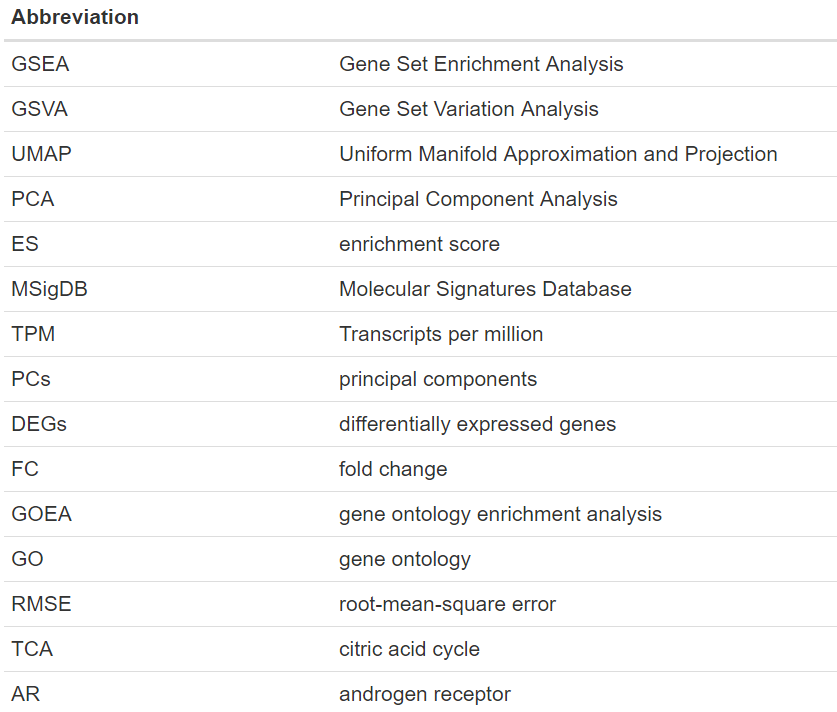
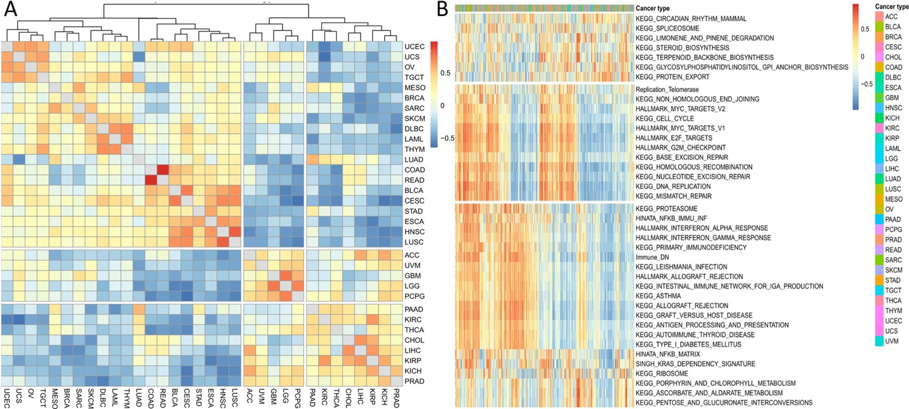

\pagenumbering{gobble}
\begin{titlepage}
\centering
	{\Large Ruprecht-Karls University of Heidelberg\\
		Faculty of Biosciences\\
		BSc Molecular Biotechnology\\}

	{\vspace{\stretch{3}}}

		{\Huge Cancer Hallmark and Metabolic Pathways differ over Cancer types and in Prostate Adenocarcinoma patients}

		

	

	\vspace{\stretch{4}}
	{\Large Data Science Project Summer Semester 2022}

	\vspace{\stretch{0.25}}
	
{\Large Submission date: 18.07.2022}

	\vspace{\stretch{0.75}}

	{\Large
		Fabian Strobel, Lottida Phondeth, Laura Lange, Carla Welz  
}

	\vspace{\stretch{1}}

\end{titlepage}

\newpage
\section*{Abstract}

The complexity of cancer cells has been broken down into certain “hallmarks of cancer” by Hanahan and Weinberg in 2000 and 2011. In this project, it was the goal to further investigate these hallmarks as well as metabolic pathways via a pan-cancer analysis. To tackle these tasks, RNA-seq expression data from “The Cancer Genome Atlas” for various tumor samples was investigated. For a greater understanding of RNA’s impact on a cell, not only genes but also the pathways they are part of were studied. To summarize the gene expression data into pathway activity, Gene Set Variation Analysis dealt as a tool for pathway or gene set scoring. Through dimensionality reduction and clustering, two clusters of cancers that differed in up- and downregulated pathways were identified. The main concern with this analysis is the loss of information, since not every RNA transcript is yet assigned to a known pathway. However, it was possible to predict pathway activity using a multivariate linear regression model.
Besides that, paired RNA-seq data of prostate adenocarcinoma and normal tissue was examined. Prostate cancer itself is the second most common cancer type found in males worldwide. After Gene Set Variation Analysis sixteen pathways showed a significantly, differentially expression within the cancer compared to normal samples. Analyzing the gene ontology of differentially expressed genes illustrated the ubiquitous effects of cancer in cells. Future studies will show how this knowledge can be expanded with epigenetic information or be used to improve diagnosis and therapy.

\newpage
\tableofcontents

\newpage
\section*{List of Abbreviations}

{width=70%}\

{width=70%}\

\newpage
\pagenumbering{arabic}
# Introduction
## Hallmarks of cancer and prostate adenocarcinoma
In 2000, Hanahan and Weinberg defined the characteristics of cancer cells in their publication “The hallmarks of cancer” [@RN20]. They described qualities such as immortalization, immune evasion, or angiogenesis that need to apply to cells to be considered a cancer cell. Additional characteristics were postulated in 2011 [@RN19]. One major hallmark that offers a myriad of pharmacological interventions is the “deregulation of cellular energetics”. Altering metabolic pathways, therefore providing an energy supply, thus supporting cell proliferation, can be seen in various cancer types such as prostate adenocarcinoma (PRAD) [@RN23].
According to estimates from the International Agency for Research on cancer, prostate cancer is the second most common cancer found in men worldwide - making up about 1.4 million cases of the 10.1 million new cases of all combined cancers diagnosed in males. While the prevalence of prostate cancer is clear, the cause of it is not. However, it has been noticed that prostate cancer can be found more commonly in older males [@RN25]. 
The most recurrent diagnosed prostate cancer type is PRAD [@RN24]. Common and effective ways to treat non-metastatic prostate cancers pose surgery and radiation therapy. Metastatic prostate cancer calls for androgen deprivation therapy [@RN18]. The absence of androgen hormones leads to a significant decrease in the progression of prostate adenocarcinoma but can sometimes be bypassed by the tumor hindering therapy. Therefore, it is necessary to understand the metabolic changes in PRAD [@RN23]. 
 
## Analysis - an overview
The data analysis project revolves around RNA-seq data derived from the Cancer Genome Atlas. It gives an overview of the sample’s transcriptomes. RNA-seq data quantifies the transcript's DNA regions and therefore describes a good way to determine their relevance in specific samples because the amount of reads of an RNA transcript determines the generation of certain proteins [@RN36].
Usually, RNA-seq data comprises copious amounts of genes, which is why analyzing single genes has been common practice [@RN12]. One major challenge is to understand the impact certain expressional changes of a specific gene can have on a whole pathway. To avoid this analyzing RNA-seq data as gene sets instead of single genes is more practical and used in methods such as Gene Set Enrichment Analysis (GSEA) or Gene Set Variation Analysis (GSVA) [@RN16; @RN12].
By analyzing the given RNA-seq data the goal was to identify patterns between various cancer types and differences between normal and cancer samples. Additionally, quantifying and clustering pathway activity was to be achieved. Principal Component Analysis (PCA), Uniform Manifold Approximation and Projection (UMAP), and heatmaps were the building blocks of dimension reduction and cluster finding [@RN34; @RN14]. 
To be able to identify gene expression patterns that apply to specific cancer types or a specific phenotype determining a score for every single pathway of each patient is crucial. GSEA and GSVA were tested for this. The former uses the two conditions of cancer and normal cell samples to determine an enrichment score (ES). The ES describes whether a predefined list of genes is represented at the top or bottom of the ranked list of genes characterizing gene expression [@RN12].  
To calculate a ranking score with the GSVA a cumulative density function is estimated for each gene over all samples.  The ranking score is the probability of the specific gene expression in the corresponding sample. These scores are then used to create a ranked list of genes for each sample being the basis to access the GSVA ES. Two random walks are done. For the first one, the algorithm iterates over each gene in the ranked list and checks if it is in the gene set. The ranks of only the genes present in the gene set are added to a running sum. In the second random walk, the value one is added to the running sum if the genes are not present in the gene set. The ES is the difference between the largest positive and negative deviations [@RN16].

# Methods
## Raw data, preprocessing and analysis of gene sets
During the project four given data sets were used: A list of gene sets for cancer hallmarks and a pan-cancer RNA-seq gene expression data frame for 9,741 patients of 33 various cancer types from “The Cancer Genome Atlas” Research Network: https://www.cancer.gov/tcga. Further, an R-object with 37 clinical annotations regarding the RNA-seq patients and for a focused analysis of PRAD, RNA-seq data of matched tumor and normal tissue of 52 PRAD patients were used. Additionally, 509 gene sets from the Molecular Signatures Database (MSigDB) [@RN10; @RN12] were gathered after a literature review to get a large overlap with RNA-seq genes, resulting in 555 total gene sets. These include 50 hallmark gene sets [@RN10], 186 curated gene sets from the KEGG pathway database [@RN5; @RN6 ;@RN7], 189 oncogenic signature gene sets [@RN10; @RN12], and the 84 largest ontology gene sets [@RN2; @RN4; @RN8]  as of June 2022.
The RNA-seq data came in a log2(TPM) format serving as a normalization technique. The original pan-cancer data frame, which contained 60,498 genes, was preprocessed according to Figure 1.

What must be pointed out, are the kept biotypes of pan-cancer analysis identified via the `EnsDb.Hsapiens.v79` package. These included small nuclear RNAs, micro RNAs, ribosomal RNAs, and small nucleolar RNAs, which are known to have important functions in molecular biology [@RN1]. Furthermore, long non-coding RNAs, which are longer than 200 bp in length and might possess regulatory functions [@RN1; @RN3] and protein-coding genes, were retained. All chosen biotypes also appeared within the pathways. After removing the other biotypes the pan-cancer data frame contained 20,675 genes. Similarly, the combined PRAD data was variance (60 % quantile threshold) and biotype filtered. In contrast, only protein-coding genes and long non-coding genes were present resulting in a final data frame with 7,801 genes.

To check the overlap of the used gene sets with the genes of the RNA-seq Venn diagrams were created. For comparison of the gene sets, their similarity was investigated. As a metric which compares how many genes are shared between the gene sets, the Jaccard Indices
$$
J(A, B) = \frac{|A \cap B|}{|A \cup B|} 
$$
were computed for each combination visualized and clustered in a heatmap. Jaccard indices lie between zero and one, which is the ratio between the intersection and union of the two respective pathways [@RN9]. 

## Pan-cancer analysis
To start off, different descriptive plots were produced based on the given data, for example checking normality, the distribution of age at diagnosis, or cancer types. For dimension reduction, PCA [@RN15] was applied over the full pan-cancer data using the `Seurat package`. With the resulting first 50 principal components (PCs), a UMAP [@RN14] with a set seed (123) was performed using the `uwot` package. By using the cosine metric two UMAP components were calculated and later plotted in a two-dimensional plot. When analyzing single cancer types only 35 PCs were used. Next, GSVA was carried out. This resulted in a pathway activity matrix with the samples as columns and 552 pathways as rows. Three pathways were discarded because of a too small intersection between pathway and RNA-seq genes, as the minimum size of the resulting gene sets was set to 3. Trying to determine the win or loss of information caused by GSVA, PCA and UMAP were applied on the pathway activity matrix as mentioned before. The pathway activity of the pathways with the highest variance was visualized in a heatmap. Finally, two linear regression models were built using the BRCA pathway activities. The BRCA patients were split into a training set (70 %) and a validation set (30 %). The “proteasome” pathway's activity was predicted first using the pathways “Immune_DN”, “mismatch_repair”, and “glycosylphosphatidylinositol gpi anchor biosynthesis” and second using 300 PCs as predictors. 

## Focused analysis: Prostate adenocarcinoma 
For the focused analysis, the normality was also checked using violin plots and qq-plots. As with the pan-cancer data, PCA and UMAP were applied on a combined data frame of tumor and normal samples. To get an impression of the differences between the two sample types, volcano plots were created. These plots allowed the identification of significantly differentially expressed genes (DEGs) or pathways. To get a symmetrical distribution around zero the log2 fold change (FC) between tumor and normal tissues was calculated for each gene or pathway and plotted on the x-axis. Genes with a log2 FC higher than +/- 1 and pathways with a log2 FC of +/- 0.4 were defined to be differentially expressed. Additionally, a paired Wilcoxon signed-rank test was performed. As significance level 0.05 was used. The computed p-value was adjusted due to multiple testing using Bonferroni correction. The -log10 p-value was then plotted as a y-axis.
To get a better understanding of the RNA-seq gene’s functions, a gene ontology enrichment analysis (GOEA) was performed. Based on the gene volcano plot, the 500 DEGs with the highest significance were extracted and their gene ontology (GO) terms were identified using `biomarRt` and `GO.db`. For every GO term, a list with the corresponding genes was created but GO terms with less than 10 genes were discarded. Finally, the GOEA was performed using the `GSVA` function as mentioned before and the combined PRAD RNA-seq data with the GO term gene lists as input. PCA and UMAP were applied to the resulting GO activity matrix as before.
Since GO terms alone do not give information about pathways, next, GSEA and GSVA were investigated. The log2 FC was used to determine a score to rank the genes of each patient. Since around 28 % of the log2 FCs had ties the GSEA couldn’t be applied here. After GSVA, which discarded 20 gene sets, a new volcano plot was created and PCA and UMAP were applied to the pathway activity matrix. Furthermore, the pathway activity of six selected upregulated pathways from the pathway volcano plot was dyed. The GSVA causes a bias because larger gene sets automatically get a higher ES. To regard this, the number of genes of a gene set that are present in the RNA-seq data and the number of  DEGs in the gene set were determined. 

# Results

## Preprocessing and analysis of gene sets
Preprocessing reduced the number of RNA-seq genes to one-third of the starting number. The remaining genes were plotted in a mean-variance plot (Appendix Figure 7A) showing a smaller number of genes with a very large variance compared to the rest. Next, the overlap between the RNA-seq genes and the gene sets was investigated. In pan-cancer analysis, 12,248 RNA-seq genes (59 %) were included in the gene sets (Appendix Figure 7B). Of the ten percent of genes with the highest variance in expression, 65 % were present within the pathways. A greater overlap was achieved in focused analysis where 6,591 RNA-seq genes (84 %) occurred within the gene sets (Appendix Figure 7C). Furthermore, the Jaccard indices as a heatmap showed the similarity between the gene sets (Appendix Figure 7D). Particularly the ontology gene sets display the greatest likeness.

## Pan-cancer analysis
The distribution of age at the initial diagnosis is left-skewed around the mean of 59 years. Regarding the distribution of cancer types (all cancer names can be found in the abbreviations) within the pan-cancer analysis, BRCA brings the most (1094) patients. The median number of samples per cancer type is 262 (mean = 295) while the cancer types ACC, CHOL, DLBC, KICH, MESO, READ, UCS, and UVM each have less than 100 samples (Appendix Figure 8). After PCA and UMAP were applied UMAP components were plotted and colored according to the 33 cancer types (Figure 2A). Around two-thirds of the cancer types built individual clusters. But not every cluster contained one cancer type. Furthermore, there were one larger and two smaller clusters consisting of multiple cancer types. To characterize the cancer type’s pathway activity, GSVA, PCA, and UMAP were applied and plotted (Figure 2B) allowing a comparison of the UMAP plots. After GSVA only ten separate clusters were visible. Whereas some of the clusters before GSVA reappeared as individual clusters, many cancer types formed one enormous cluster. To learn about the differences between the enormous cluster and the smaller ones, the pathway activity for the nine pathways with the largest variance across all cancer types was dyed (Figure 2C). These pathways include cell cycle, DNA replication and repair, the E2F transcription factor family, proteasome, and the oncogenes Myc and Kras. In general, the enormous cluster and one small cluster showed increased pathway activity (BLCA, BRCA, CESC, COAD, DLBC, ESCA, HNSC, LAML, LUAD, LUSC, MESO, OV, PAAD, READ, SARC, SKCM, STAD, TGCT, THYM, UCEC, UCS, UVM). The remaining clusters showed rather decreased pathway activity (ACC, CHOL, GBM, KICH, KIRC, KIRP, LGG, LIHC, PCPG, PRAD, THCA). When UMAP was performed on each separate cancer type, BRCA, ESCA, KIRC, LAML, LUAD, TGCT and THYM showed subclusters. After GSVA only BLCA and TGCT showed clusters.

The pan-cancer clusters were mostly verified by a correlation heatmap, where the mean pathway activity per cancer type was computed (Figure 3A). The two clusters match the UMAP clusters with two exceptions: PAAD and UVM were clustered with the down-regulated cancer types from the UMAP. The correlation heatmap showed a strong correlation between COAD and READ and between HNSC and LUSC.

Looking at the 30 pathways with the highest variance among all patients, three major clusters were identified (Figure 3B): A rather metabolism-oriented group, a DNA and cell cycle-oriented group, and an immune system-oriented group.

Based on the pathway activity matrix, another goal was to build a linear regression model which predicted the “proteasome” pathway’s activity (Figure 4). The pathway model had a smaller R-squared value (0.625) than the PC model (0.842). In the pathway model, the root-mean-square error (RMSE) of the validation model was like the RMSE of the training model, whereas in the PC model the RMSE of the validation model was almost twice as large as the training model.

## Focused analysis
To show differences in gene expression between tumor and normal samples, a volcano plot was created (Figure 5A). Each dot corresponds to one gene. 998 genes were significantly downregulated in tumor tissue (blue). The 347 upregulated genes are shown in red. For GOEA the GO terms of the 500 DEGs with the highest significance (above the upper horizontal line in the volcano plot) were determined. 484 genes were matched with at least one GO term. Some GO terms with the highest frequency were “protein binding”, “membrane”, “cytoplasm”, or “nucleus” (Figure 5B). GSVA with the GO gene sets, PCA, and UMAP were applied, showing two separated clusters (Figure 5C left). Annotating the sample type revealed that the two clusters are formed by tumor and normal samples including both four samples from the opposite tissue, respectively. Looking at the normal samples, there is a horizontal "gap" within the “normal” cluster. This "gap" is far greater when performing the GSVA with the gene sets from pan-cancer analysis (Figure 5C right). Here, there are two separated clusters of normal samples and one widely scattered tumor cluster containing again four normal samples.

After GSVA another volcano plot was created, in which the dots represent pathways (Figure 6A). There were five downregulated and eleven upregulated gene sets. The eleven upregulated gene sets differ in gene set size and FC (Figure 6B). The gene set "myc targets V2" had the highest FC of 0.848 and is the largest upregulated gene set with 236 genes. In total, only 3.3 % of the genes in the gene set were differentially expressed. The gene set "E2F targets" had the second largest FC of 0.751 and 11.0 % upregulated genes. The gene sets "G2M checkpoint" (13,7 %), "androgen response" (11.8 %), and "E2F targets" (11.0 %) contained the most DEGs. Dying the samples according to the pathway activity of six upregulated pathways, the differences between tumor and normal samples were visualized (Figure 6C). The two normal clusters were rather downregulated, not being identical. The tumor samples were mostly upregulated. 

# Discussion
In pan-cancer analysis, two major clusters of cancers were identified. A pathway activity matrix supported the idea of upregulated cancer hallmarks. The focused analysis of PRAD revealed the differences between tumor and normal samples.

## Preprocessing and analysis of gene sets
The analysis with the Venn diagrams showed that not every RNA-seq gene is represented at least once in any gene set, resulting in information loss whenever a method only uses the genes included within the gene sets. This effect is stronger in the pan-cancer analysis than in the focused analysis. Not only does this show a downside of reducing the data into pathways but also stresses how much information about transcriptomics is yet to be discovered. The Jaccard indices showed rather small similarity between most gene sets. This was useful to cover as many RNA-seq genes as possible. Careful analysis with the chosen gene sets was possible and performed. It shows that most ontology gene sets are more similar than others as they were clustered together. The reason might be that these gene sets are quite large since gene ontology terms like “chromosome” or “cell cycle” are very broad and include cellular structures.

## Pan-cancer analysis
The comparison of the UMAP plots before and after GSVA showed that information seemed to be lost within the pathway activity matrix. On the one hand, some cancer types of clusters were preserved, but on the other hand, many clusters were lost or condensed into one enormous cluster. Dying the clusters according to highly variant pathway activity indicates the possibility to split the cancer types into two main groups. This is a very unsatisfying result, hinting that either the pathways used in the study did not cover enough of the RNA-seq information or some cancer types are too alike to be separated based on the used pathways. Eventually, the hallmarks of cancer [@RN19] are characteristics shared among most cancers. The next step would be to refine this analysis. The same trend was also visible when checking the cancer types by themselves. Based on the clinical annotations, the cancer ESCA could be separated by the subtypes Esophagus Adenocarcinoma and Esophagus Squamous Cell Carcinoma and TGCT by Seminoma and Non-seminoma. But only TGCT and BLCA showing clusters after GSVA again emphasizes the loss of information.
The cancer-type correlation heatmap (Figure 3A) supported mostly the findings from UMAP after GSVA (Figure 2B). The two strongly correlating pairs were READ and COAD, and HNSC and LUSC. READ and COAD not-only share a close localization, but also share histological, genetic, and methylation patterns [@RN32]. HNSC and LUSC have multiple molecular characteristics in common, although they are genetically and heterogeneously diverse [@RN33].
The heatmap for 30 pathways with the highest variance in their activity allowed clustering them into three main groups: metabolism, DNA/cell cycle, and immune response. These three groups are part of the hallmarks of cancer [@RN19]. For a more precise analysis, it would be necessary to group the used gene sets to the 10 hallmarks. Nevertheless, it would be different to make these assignments since they also overlap with each other. Interestingly, in this heatmap, there are no clear clusters for the 33 cancer types. This suggests that these pathway activities vary even among the same cancers so much that they could not be clustered together. 
Eventually, a multivariate linear regression model was built. Although the pathway model explained less of the total variance of the model than the PC model, it was the more promising model. The much higher RMSE of the PC validation set, suggests strong overfitting when using the 300 PCs as predictors. To improve the pathway model, better suiting pathways must be found. As a next step, it might also be interesting whether it is possible to predict a cancer type based on RNA-seq data respective pathway activity.

## Focused analysis
The volcano plots illustrate the differences in expression between tumor and normal cells. Knowledge about GO terms of the DEGs between normal and tumor samples of PRAD allowed an insight into the cellular functions. Computing the GO term frequency showed that changes caused by cancer cannot be pinned down to a restricted part of a cell, but rather causes changes within the whole cell. The GOEA resulted in two almost pure sample clusters. The four respective exceptions could not be explained with known clinical annotations. It is also to be considered that only the 484 most significantly DEGs were part of the GO gene sets. Striking was the horizontal gap between the normal sample clusters within the UMAP. This gap is by far greater after the GSVA with the gene sets. Again, no clinical annotations explained this effect. The GSVA used many more pathways and genes than the GOEA. The four normal samples within the tumor samples are also visible here. In general, even though the Venn diagram showed a better overlap with the RNA-seq data in the focused analysis than in the pan-cancer analysis, the clustering results are more scattered. One explanation might be that the GSVA uses one combined data frame as input. One major difference was that the pan-cancer analysis only had cancer samples, the focused analysis used normal samples. Another interesting fact is that in the pan-cancer analysis PRAD was part of the scattered clusters with downregulated pathway activity. But some of the pathways reappeared in the focused analysis as upregulated compared to normal cells. Hence, the pathways seem to be upregulated to a certain level in PRAD, but not as much as compared to cancers of the enormous pan-cancer cluster. Perhaps the pathway activity is still too similar between tumor and normal cells in PRAD.
The volcano plot for the pathways also shows that only a small number of pathways is differentially expressed between the sample types. The GSVA considered to which degree the genes are up or downregulated. However, it does not correct against the pathway size which also affects the results. 
The volcano plots show only five gene sets were downregulated and eleven gene sets that were upregulated. Because gene sets with a relatively low log2 FC of +/- 0.4 were defined to be differentially expressed this explains the low differential expression of the gene sets in PRAD. To our knowledge, no source confirms that gene downregulation is more common than gene upregulation in Prostate Adenocarcinoma. However epigenetic alterations like DNA methylations, which are common in PRAD, could explain this observation [@RN35]. By taking the pathway size into account, one gene set containing plenty of DEGs that specifically stands out is the “androgen response”. Healthy prostate epithelium cells that potentially could give rise to PRAD have a unique metabolic background themselves, for they contain large amounts of zinc that prevent the oxidation of citrate, which thus can inhibit the citric acid cycle (TCA). Thus, making normal prostate epithelial cells dependent on different energy sources such as glycolysis. The control of the previous steps mentioned has been described to be controlled by the androgen receptor (AR) response. Once bound to an androgen hormone the AR acts as a transcription factor by traveling to the nucleus and thus activating the expression of metabolism-promoting genes in prostatic epithelial cells.  
Mutations in the androgen response pathway could potentially wreak havoc in favor of cancer progression. These mutations could lead to the promotion of the TCA and therefore could lead to dependence on oxidative phosphorylation. This metabolic shift has been noticed in early prostate adenocarcinomas. Since this project revolved around RNA-seq data it can’t definitively be stated that the cause for the upregulation of the “androgen response” is the result of mutations, but crucial similarities between literature [@RN23] and the RNA-seq analysis could be found.
On top of that, the plausible differential expression within the genes of the “G2M checkpoint” and the “E2F targets” can also be substantiated by literature. The G2M checkpoint itself is important for halting the cell cycle once DNA replication has been faulty whereas E2F itself is a DNA promotor binding protein that promotes the transcription of protein-coding genes. Therefore, irregularities in this checkpoint could potentially lead to tumor growth progression [@RN1].   
Generally, the upregulation of the tumor samples in the six UMAP graphs is concordant with the prior discussed revelations regarding the androgen response or even the G2M checkpoint-associated genes being upregulated. On the contrary, it is not completely clear why the normal samples in all these graphs can be separated into two clusters. It must be questioned though whether the gap between the two clusters increased because of their dissimilarities or because these samples simply didn’t belong to the same cluster regardless of the severity of dissimilarities.
The study showed that using pathways for enrichment analysis is a promising tool for further analysis of cancer data. The main problem to face will be the loss of information since not every RNA's function is known yet or classified in any pathway. The existence of differences in PRAD samples compared to normal samples was confirmed. Future studies will show whether this information can be used for the early detection of cancers or therapy. Furthermore, epigenetic alterations will be an increasing factor in cancer analysis. Upcoming studies can include epigenetic profiles as provided by "The Cancer Genome Atlas" [@RN38].

\newpage

# References

# Appendix

## R packages used throughout the project
{width=90%}\

## Additional figures

{width=80%}

\vspace{\stretch{0.25}}

{width=80%}
